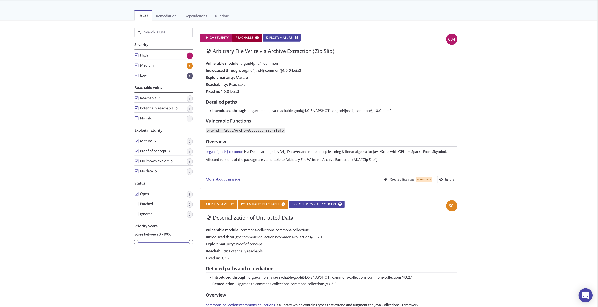

# DevSecOps AWS and Terraform laboratory

Welcome to the DevSecOps AWS and Terraform laboratory! This hands-on laboratory is designed to immerse you in the world
of DevSecOps, focusing on AWS and Terraform. Through practical exercises and real-world scenarios, you'll gain valuable
insights into implementing security practices seamlessly into your development and operations workflows.

# Java Reachability Playground

Explore the capabilities of Snyk's Reachable Vulnerabilities feature with this intentionally vulnerable Java
application. It showcases both a "Reachable" vulnerability, demonstrating a direct data flow, and a "Potentially
Reachable" vulnerability, where only partial data exists for determining reachability.

## Included Vulnerabilities

1. **Arbitrary File Write via Archive Extraction**
    - Exploits the critical [ZipSlip vulnerability](https://snyk.io/research/zip-slip-vulnerability) using a specially
      crafted zip archive.
    - Demonstrates the risk of remote command execution and file overwriting.

2. **Deserialization of Untrusted Data**
    - Highlights a potentially vulnerable code, showcasing a scenario where data about vulnerable functions is not
      available.

## How to Run the Demo (Maven)

1. Checkout this repository (`git checkout git@github.com:snyk/java-reachability-playground.git`).
2. Install dependencies (`mvn install`).
3. Compile the project (`mvn compile`).
4. Run the main class (`mvn exec:java -Dexec.mainClass=Unzipper`); expect an exception
   indicating `Malicious file /tmp/evil.txt` was created.
5. Run Snyk command with Reachable Vulnerabilities flag (`snyk test --reachable` or `snyk monitor --reachable`); observe
   the marked reachable vulnerability `SNYK-JAVA-ORGND4J-72550` and the function call path to the vulnerability.

## For Gradle

1. Build artifacts with `./gradlew build`.
2. View test results with `snyk test --file=build.gradle --reachable` or
   monitor: `snyk monitor --file=build.gradle --reachable`.

*Note: After running the Java application, `malicious_file.zip` will be deleted. To rerun, use `git checkout .` before
the next run.*

## Screenshots

### CLI

### Snyk UI

## Getting Started

Follow these steps to get started with the course:

1. [Create AWS Free Tier Account](#1-create-aws-free-tier-account)
2. [Install Git on your Machine](#2-install-git-on-your-machine)
3. [Connect Git Bash with AWS CodeCommit](#3-connect-git-bash-with-aws-codecommit)
4. [Clone the vulnerable code from the Git repository](#4-clone-the-vulnerable-code-from-the-git-repository)
5. [Create a new AWS Code repository](#5-create-a-new-aws-code-repository)
6. [Push Vulnerable application code to AWS CodeCommit using Git Bash](#6-push-vulnerable-application-code-to-aws-codecommit-using-git-bash)

# Security Terms Overview

For a detailed explanation of the security terms used throughout the course, please refer to
the [Security Terms Overview](./security_terms.md) document.

## Tools Explanation

For detailed information about the tools used in this course, refer to the [Tools Explanation](./tools_explanation.md)
document.

## Step-by-Step Explanation

For detailed explanation about this set up go to [Walking Through](./walking_through.md)
