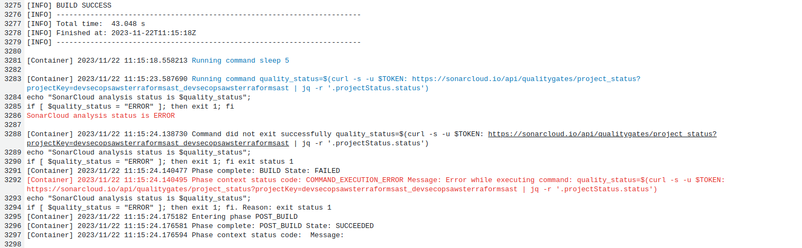
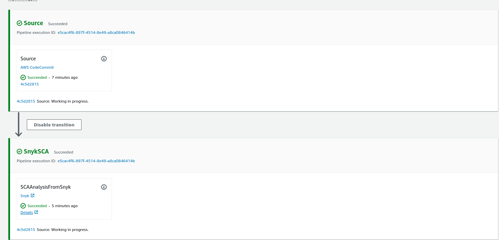
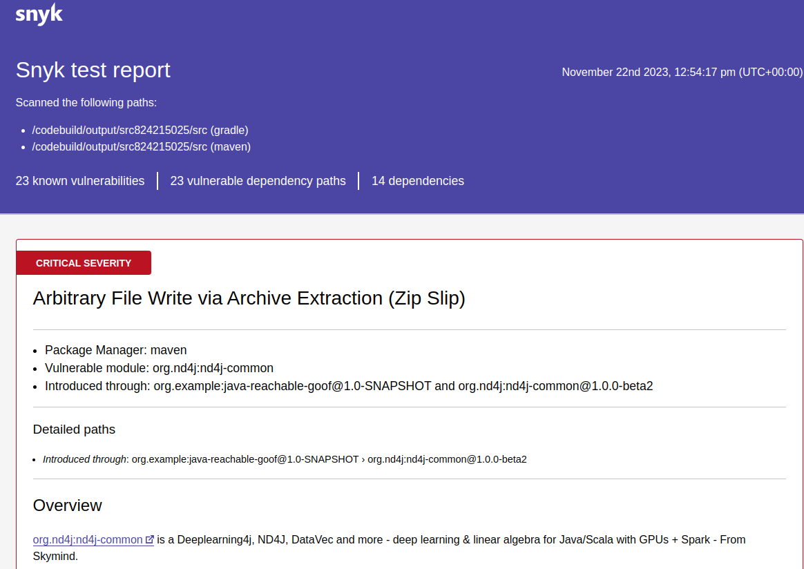
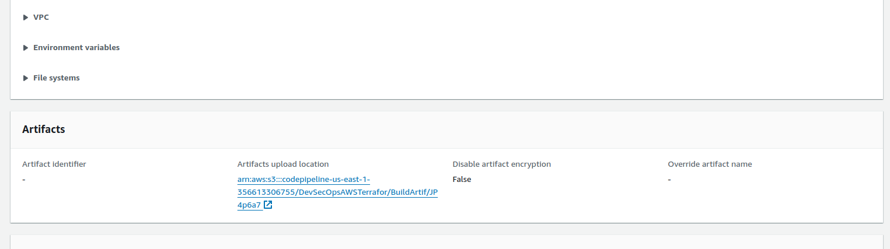
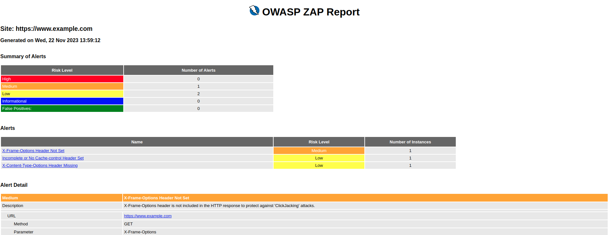

### 1. Create AWS Free Tier Account

Visit the [AWS Free Tier](https://aws.amazon.com/free/) page and follow the instructions to create a new AWS account.
Ensure that you understand the terms and conditions of the AWS Free Tier.

### 2. Install Git on your Machine

Download and install Git on your local machine. You can find the Git installer for various operating
systems [here](https://git-scm.com/downloads).

### 3. Connect Git Bash with AWS CodeCommit

Follow these steps to connect Git Bash with AWS CodeCommit:

- Open Git Bash on your machine.

- Configure Git with your AWS credentials:

```bash
git config --global credential.helper '!aws codecommit credential-helper $@'
git config --global credential.UseHttpPath true
```

- Configure AWS CLI with your credentials:

```bash
aws configure
```

- Follow the prompts to enter your AWS Access Key ID, Secret Access Key, region, and preferred output format.

### 4. Clone the vulnerable code from the Git repository

Use the following command to clone the vulnerable code repository:

```bash
git clone https://github.com/asecurityguru/aws-vulnerable-code-without-buildspec
```

Navigate to the cloned directory using:

```bash
cd aws-vulnerable-code-without-buildspec
```

### 5. Create a new AWS Code repository

Go to the [AWS CodeCommit Console](https://console.aws.amazon.com/codecommit/) and create a new repository. Follow the
prompts to configure the repository settings.

### 6. Push Vulnerable application code to AWS CodeCommit using Git Bash

Follow these steps to push the vulnerable application code to AWS CodeCommit:

- Navigate to the local repository directory:

```bash
cd path/to/aws-vulnerable-code-without-buildspec
```

- Initialize a Git repository (if not already initialized):

```bash
git init
```

- Add the AWS CodeCommit repository as a remote:

```bash
git remote add origin <AWS CodeCommit repository URL>
```

- Add and commit the files:

```bash
git add .
git commit -m "Initial commit"
```

- Push the code to AWS CodeCommit:

```bash
git push -u origin master
```

Replace `<AWS CodeCommit repository URL>` with the URL of the AWS CodeCommit repository you created in step 5.

Now, your vulnerable application code is pushed to the AWS CodeCommit repository.

Note: Make sure you have the necessary permissions and access to the AWS CodeCommit repository. Adjust AWS CLI
configurations accordingly if needed.

Certainly! Here's a step-by-step guide:

### 7. Create a SonarCloud Account and Set Buildspec.yaml in AWS Repository

#### Part 1: Setting Up Buildspec.yaml in AWS Repository

1. Navigate to your AWS repository.

2. Click on your repository name to access the repository.

3. Add a new file by clicking on the "Add file" button.

4. In the new file editor, paste your code.

5. Specify the file name as `buildspec.yml`. AWS conventionally uses this name for the build specification file. You can
   choose a different name, but remember to adjust references accordingly later.

6. Authorize the changes with your credentials, providing your name and a security email.

7. Commit the changes to the repository.

8. Verify that the new file [`buildspec.yml`](./buildspec.yml) has been successfully added by checking the repository.
   -- Additional step: Change the [`pom.xml`](./pom.xml) and add Unit and Jacoco, also sonar cloud parameters.

#### Part 2: Creating a SonarCloud Account and Obtaining Project Key, Project Organization, and Token

1. In the next chapter, we will create a SonarCloud account. Navigate to
   the [SonarCloud website](https://sonarcloud.io/) and sign up for an account.

2. Once logged in, create a new project on SonarCloud.

3. Retrieve the project key and project organization from SonarCloud. These values are essential for integrating
   SonarCloud with your AWS repository.

4. Generate an authentication token on SonarCloud. This token will be used to establish a secure connection between
   SonarCloud and your AWS repository.

Now, you are ready to proceed with the next steps in your DevSecOps AWS and Terraform course, integrating SonarCloud
into your CI/CD pipeline for enhanced code quality analysis.

### 8. Create a new Code Commit on AWS.

Select the Code repository and set Build definitions. Leve almost everything as default, select Ubuntu as S.O.

### 9. Create a role in order to allow build to access Secret Key

we had created one sonar token, which we had placed in our directly placed in a `buildspec.yml` file in the NewRepo, but
in real world we do not place tokens
directly in the repositories instead we will store it in AWS Secrets Manager. The steps involved are as follows:

1. Copying Token to Secrets Manager:
    - Copy the Sonar token from the `buildspec.yml` file.
    - Open AWS Secrets Manager and create a new secret.
    - Enter a key-value pair, with the key as "token for sonar" and the copied token as the value.
    - Name the secret as "first secret" and complete the creation process.

2. Updating `buildspec.yml` File:
    - Open the `buildspec.yml` file.
    - Add an `environment` command, indicating the use of Secrets Manager.
    - Specify the variable name as "token" and provide the secret name ("first secret") and key name ("token for
      sonar").

3. Committing Changes:
    - Replace the existing token variable in the script with the actual value using the syntax `$variable_name`.
    - Save the changes to the `buildspec.yml` file.
    - Commit the changes to the repository.

4. Handling Permissions for CodeBuild:
    - Attempt to build the project.
    - The build fails due to a lack of permission for the CodeBuild project to read values from Secrets Manager.
    - Navigate to IAM in AWS and click on roles.
    - Identify the CodeBuild AWS project role (e.g., `build-1 service role`) and grant the necessary permissions to read
      values from Secrets Manager.

The training also includes a README file with steps for setting up a vulnerable code repository, connecting Git Bash
with AWS CodeCommit, and creating a new AWS Code repository. Additionally, there are instructions for creating a
SonarCloud account, obtaining project key, organization, and token, and integrating SonarCloud into the CI/CD pipeline.

It's important to note that the specific details of the commands and configurations may vary based on the actual content
of the files and AWS configurations used in the training.

### 10. Defining SonarQuality

Now it is time to set up a SonarQuality Gate. Go to SonarCloud into your project -> QualityGate tab create a new custom
QualityGate.
-- Name: Custom Quality Gate
-- Metric: Coverage
-- Operator: is less than
-- Value: 80.0%
And set it as Default.
Now run the Build on AWS Build Projects and you will get the follow error:


Set QualityGate as Sonar way to skip to continue, it will ignore the errors.

### 11. Defining an AWS CodePipeline:

- Access AWS CodePipeline:

- Open the AWS Management Console and navigate to AWS CodePipeline --> Create a New Pipeline:

- Click on "Create pipeline" to start the pipeline creation process --> Pipeline Settings:

- Provide a name for your pipeline (e.g., FirstCodePipeline).

AWS will create a service role automatically, so you don't need to create one.
Ensure there are no spaces in the pipeline name.

- Advanced Settings:

In advanced settings, choose whether to store artifacts in the default location or a custom one.
Use default AWS managed encryption key unless you have a custom key.
Source Provider:

- Select the source provider from where the code will be fetched (e.g., AWS CodeCommit).
- Choose the repository name (if you have multiple repos).
- Specify the branch name (e.g., master).
- Configure AWS CloudWatch Events to trigger the pipeline on code changes.
- Use the default code pipeline format for output artifacts.

- Build Provider:

Choose the build provider (e.g., AWS CodeBuild).
Select the CodeBuild project you've already created.
Proceed to the next step.
Deployment (Optional):

Skip this stage if you don't want to deploy anywhere.
Review the pipeline information to ensure it's correct.

- Create Pipeline:

Click on "Create Pipeline" to initiate the pipeline creation process.
Pipeline Execution:

The pipeline will start building your code from the specified CodeCommit repository.
Monitor the progress in the AWS CodePipeline dashboard.
Check the CodeBuild project to track the build progress.
Verification:

Ensure that the pipeline successfully fetches code, builds it, and, if applicable, deploys it.

### 12. Integrating Snyk into Amazon CodePipeline for SCA Analysis

Access CodePipeline:

- Open the AWS Management Console and navigate to AWS CodePipeline.

Open Existing Pipeline:

- Locate and open the existing CodePipeline that you want to enhance with Snyk integration.

Edit Pipeline:

- Click on "Edit" to modify the pipeline configuration.

Add a New Stage:

- Within the pipeline configuration, click on "Add stage" to insert a new stage in the pipeline.

Name the Stage:

- Provide a name for the new stage, for example, "SnykSCA."

Add Action Group:

- Click on "Add Action" within the newly created stage.
- Specify an action name, such as "SCA analysis from Snyk."

Select Snyk as Action Provider:

- Choose "snyk" as the action provider for SCA analysis.

Configure Input Artifacts:

- Select the input artifacts, usually linked to your source code.

Connect Snyk to GitHub:

- Choose GitHub as the integration platform.
- Authorize Snyk to use your GitHub account.
- Create an organization (e.g., "Security Guru") on behalf of Snyk.

Define Deployment Behavior:

- Specify whether to stop deployment on Snyk errors (uncheck for SCA analysis).
- Optionally, configure blocking deployments based on vulnerability severity (e.g., low).

Configure Monitoring Behavior:

- Set monitoring behavior on build (e.g., "never monitor").

Complete OAuth Request:

- Process the OAuth request for integration.

Provide Output Artifact Name:

- Name the output artifact for Snyk SCA analysis (e.g., "snyk SCA analysis output").

Save the Action Configuration:

- Click "Done" to save the Snyk action configuration.

Save the Pipeline Configuration:

- Save the entire pipeline configuration to apply the changes.

Release Changes:

- Click on "Release Change" to initiate the pipeline update.

Start the Pipeline Build:

- Confirm and initiate the release to trigger the pipeline build.
- The pipeline will fetch the latest changes from the source code and run Snyk SCA analysis.

Monitor Pipeline Execution:

- Observe the pipeline execution as it progresses through the Snyk SCA stage.

Review Snyk SCA Analysis Results:

- Examine the Snyk SCA analysis results within the pipeline.
  

- View the generated Snyk test report highlighting vulnerabilities in the source code.
  

Ensure Pipeline Completes Successfully:

- Confirm that the entire pipeline completes successfully, integrating both Snyk SCA and SonarCloud analyses.
- Verify the secure CI/CD build pipeline functionality.

### Step 8: Storing CodeBuild Artifacts in an S3 Bucket

Access AWS CodeBuild:

- Navigate to the AWS CodeBuild console and access the "Build projects" page.

Select Build Project:

- Choose the specific build project you want to configure. For example, "AWS Project Build -1."

Open Build History:

- Click on the selected build project to open the "Build History" page for "AWS Project Build -1."

Access Edit Options:

- Locate and click on the "Edit" option, typically found on the Build History page.

Navigate to Artifacts:

- Within the editing options, find and click on the "Artifacts" configuration.

Edit Artifacts Page:

- You will be redirected to the "Edit Artifacts" page. Choose the type of artifact storage; in this case, select "
  "Amazon S3."

Select S3 Bucket:

- Once Amazon S3 is selected, choose the specific S3 bucket where you want to store the artifacts.
- Click on the selection area to view and choose from the available S3 buckets.

Choose S3 Bucket:

- Since you have a CodePipeline bucket in us-east-1, select it as the destination for storing artifacts.

Update Artifacts:

- Scroll down and look for an "Update Artifacts" or similar option. Click on it to apply the changes.

Confirmation Message:

- After the update, a confirmation message will appear, stating that the artifacts for the build project have been
  successfully updated.

Verify Artifacts Location:

- Check the information provided to confirm that the artifacts upload location is now the selected S3 bucket.

Future Builds:

- From now on, all artifacts generated by this build project will be automatically stored in the configured S3 bucket.

Integration with OWASP ZAP (Next Step):

### 13. Integrating OWASP Zap into AWS DevSecOps Pipeline for DAST Scan

Access CodeCommit and Open [`buildspec.yml`](./buildspec.yml):

Navigate to the AWS CodeCommit repository, specifically the "YourRepository".
Open the buildspec.yml file.
Add ZAP Integration Code:

Within the buildspec.yml file, add the following code to integrate OWASP ZAP for DAST scan:

```yaml
version: 0.2
phases:
  pre_build:
    commands:
      - apt-get update
      - apt-get install -y wget
      - apt-get install -y default-jdk
      - wget https://github.com/zaproxy/zaproxy/releases/download/v2.11.1/ZAP_2.11.1_Linux.tar.gz
      - mkdir zap
      - tar -xvf ZAP_2.11.1_Linux.tar.gz -C zap
      - cd zap/ZAP_2.11.1
      - ./zap.sh -daemon -quickurl https://www.example.com -quickprogress -quickout zap_report.html
  post_build:
    commands:
      - aws s3 cp zap_report.html s3://your-s3-bucket-name/  # Optional
artifacts:
  files: zap_report.html
```

Replace *your-s3-bucket-name* with the actual name of your S3 bucket.

Trigger CodeBuild:

Monitor Build Progress:

Observe the build progress on the AWS CodeBuild console.

Review ZAP Scan Results:

Go to build results and access the latest build - scrown down until see Artifacts.

Access the build details to view the progress and completion of the ZAP scan.
Download the generated artifact (zip file).

Open ZAP Report:

Extract the zip file and open the zap_report.html file.
Review identified security issues, including their severity and details.
Take note of mitigation suggestions provided by OWASP ZAP.



Collaborate with Dev Team:

Work with the development team to address and resolve identified security issues.
Report true positives in JIRA or ServiceNow and assign them to the development team.
Re-run the Scan:

After the development team fixes the issues, re-run the ZAP scan to ensure resolution.
Regularly perform DAST scans as part of your day-to-day responsibilities.

### 12. Implementing VPC

- Accessing Build Project: -> Open your AWS CodeBuild console and navigate to the specific build project that requires
  VPC integration.

- Editing Build Project: -> Click on the "Edit" option within the selected build project.

- Navigating to Environment Settings: -> Within the editing options, go to the "Environment" section.

- Configuring Additional Settings: -> Click on "Additional configuration" to reveal advanced settings.

- VPC Configuration: -> Locate and click on the "VPC" settings.

- Select the appropriate VPC that your AWS CodeBuild project needs to access.

- Choosing Subnet and Security Group: -> Choose the relevant subnet and security group associated with the selected VPC.

- Updating Environment: -> Once the VPC values are configured, click on "Update environment" to apply the changes.

- Reviewing VPC Configuration: -> Validate the changes made in the AWS CodeBuild project.

- Navigating to VPC Dashboard: -> Go to the AWS VPC dashboard to further configure VPC endpoints.

- Creating VPC Endpoint: -> Create a VPC endpoint to establish a connection between AWS CodeBuild and the resources
  within the VPC.
  Provide a name for the endpoint (e.g., vpc-code-build-endpoint).

Selecting Service Category:
Choose the service category. Since AWS services are being used, keep the default selection.
Choosing CodeBuild Service:

Search for and select the "CodeBuild" service.
Selecting VPC, Subnet, and Security Group:

Choose the specific VPC, subnet ID, and security group associated with the CodeBuild project.
Creating VPC Endpoint:

Click on "Create endpoint" to finalize the endpoint creation.
Validation:

Confirm that all settings have been configured successfully.
Accessing VPC Resources:

With the VPC endpoint in place, your CodeBuild project is now capable of accessing any resource within the selected VPC
securely.